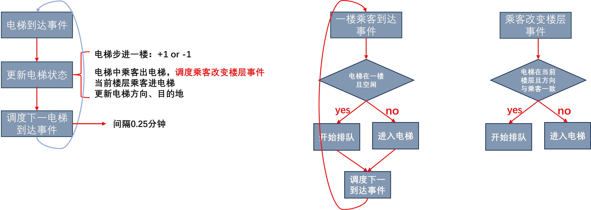

# 电梯模型建模与仿真——基于GPSS实现

姓名：彭奔康				学号：24026161

### 问题描述

本实验旨在模拟一座五层办公楼内单部电梯的运行情况，并分析其性能。 该办公楼只有一部电梯，服务于1楼（底层到5楼。乘客到达1楼的间隔时间服从均值为1分钟的指数分布。每位乘客前往2到5楼的概率均为0.25。电梯每层楼的运行时间为15秒。假设电梯在各楼层停靠时，上下客时间忽略不计。乘客在到达某一层楼后，会在该楼层停留一段时间，该停留时间服从15到120分钟之间的均匀分布。当乘客离开i层楼（i=2,3,4,5）时，他/她将以0.7的概率返回1楼，以0.1的概率前往其他三层楼中的任意一层。电梯最多可容纳6人，并从1楼启动。如果到达某一层楼时，等待的乘客数量超过电梯的载客量，则多余的乘客将继续排队等待。到达1楼的乘客将立即离开大楼。

电梯的控制逻辑如下：

- 当电梯向上运行时，如果当前有乘客需要前往更高楼层，或者更高楼层有乘客需要搭乘电梯，则电梯将继续向上运行。
- 当电梯向下运行时，如果电梯内至少有一名乘客，或者较低楼层有乘客等待，则电梯将继续向下运行。
- 如果电梯位于i层（i=2,3,4），并且正在向上（向下）运行，则电梯不会立即搭载需要前往向下（向上）楼层的乘客。
- 当电梯空闲时，其起始楼层为1楼。
- 电梯在每一层楼决定其下一个目的地楼层，并且不会在楼层之间改变运行方向。

本实验的目标是通过模拟，研究在给定的参数和控制逻辑下，电梯内平均载人数量，以及乘客的平均等待时间等关键性能指标

### 问题分析

##### 离散事件仿真

本实验将采用**离散事件仿真(Discrete Event Simulation)**的建模方法进行模型建立。

**离散事件仿真**是一种模拟系统动态行为的方法，它关注的是系统中发生的离散事件及其对系统状态的影响。  系统状态只在事件发生时发生变化，事件之间的时间间隔可以是任意的，而非均匀的时间步长。模拟器维护一个**事件列表**，按照**时间顺序排列**即将发生的事件。  模拟过程从**事件列表**中取出最早发生的事件，更新系统状态，并根据事件的结果生成**新的事件**添加到事件列表中，如此循环往复，直到满足预设的终止条件，例如模拟时间达到上限或系统达到稳态。 这种方法特别适用于那些状态变化不频繁，但状态变化对系统影响较大的系统，例如**排队系统**、生产线、交通系统等，能够有效地模拟这些系统的运行过程，并分析其性能指标，例如平均等待时间、吞吐量等。  离散事件仿真通常采用面向对象的编程语言或专门的仿真软件实现，并通过统计分析方法对仿真结果进行评估。

##### 流程图

电梯模型分为三种事件：

* 电梯到达事件：电梯到达某一层楼是一个电梯到达事件，每个电梯到达事件之间的事件间隔为0.25分钟。
* 一楼随机来人的事件
* 结束仿真事件：当仿真事件到达20h时，处理结束仿真事件，立即结束仿真。



上图是电梯调度事件的处理步骤：

1. **电梯到达事件**：当电梯到达一个楼层时，触发一个事件。
2. **更新电梯状态**：根据电梯的当前状态和乘客的需求，更新电梯的状态。这包括以下几个方面：
   - **电梯步进一楼**：电梯向上或向下移动一层楼，用 `+1` 表示向上，`-1` 表示向下。
   - **电梯中乘客出电梯**：如果电梯中有乘客到达了目的地楼层，他们将离开电梯。同时，如果有乘客在当前楼层进入电梯，系统会更新这些乘客的目的地。
   - **更新电梯方向、目的地**：根据乘客的目的地，更新电梯的下一个目标方向和楼层。
3. **调度下一电梯到达事件**：根据更新后的电梯状态，调度系统会计算并安排电梯到达下一楼层的时间(电梯移动一层楼耗时0.25分钟)，然后触发下一个电梯到达事件。


一楼以均值1分钟的指数分布到达乘客，若当前电梯在一楼且处于空闲状态，则

### 建模框架

##### GPSS简介

GPSS (General Purpose Simulation System) 是一种面向过程的离散事件仿真语言，专为模拟各种系统而设计，尤其擅长于建模和分析排队系统、生产线、交通系统等。它以其简洁的语法和强大的建模能力而闻名，即使对于复杂的系统，也能用相对较少的代码实现模拟。GPSS 的核心思想是将系统分解成一系列相互关联的模块，每个模块代表系统的一个组成部分，并具有特定的功能。这些模块通过事务（**Transaction**）的流动来模拟系统的动态行为。事务代表系统中的实体，例如顾客、零件、车辆等，它们在模块之间移动，模拟实体在系统中的流程。

GPSS 的独特之处在于其独特的建模方法。它不像许多其他仿真语言那样需要用户显式地编写事件处理程序。相反，GPSS 提供了一组预定义的模块，用户只需将这些模块连接起来，定义它们之间的关系和参数，即可构建一个完整的系统模型。  这些模块涵盖了各种常见的系统组件，例如生成器 (**GENERATE**) 用于创建事务，队列 (**QUEUE**) 用于模拟等待，占用 (SEIZE) 和释放 (RELEASE) 用于模拟资源的分配和释放，以及推进 (ADVANCE) 用于模拟时间延迟。通过巧妙地组合这些模块，用户可以创建出非常复杂的系统模型，而无需编写大量的代码。

GPSS 的另一个重要特点是其内置的统计功能。在模拟运行过程中，GPSS 会自动收集各种统计数据，例如队列长度、等待时间、资源利用率等。这些数据可以帮助用户评估系统的性能，并识别系统的瓶颈。GPSS 提供了多种报表和图表工具，方便用户查看和分析模拟结果。  这些统计数据无需用户额外编程就能自动生成，极大地方便了分析。

### 代码分析

##### 初始化

```assembly
**************************************************
*  initial
	elevator STORAGE 6	;
	RMULT      39941	;random seed
```

本实验的初始化部分包含两个关键参数：

- **elevator STORAGE 6**: 此语句定义了电梯的载客量为6人。 STORAGE 指令指定了电梯的存储容量，即电梯最多可容纳6名乘客。这是模拟电梯物理限制的关键参数。
- **RMULT 39941**: 此语句使用数值 39941 作为随机数生成器的种子 (RMULT 指令通常用于设置随机数生成器的乘数)。 随机数种子用于生成乘客到达时间等随机事件，确保每次模拟运行的结果具有一定的随机性，从而更接近真实场景。不同的种子值将产生不同的随机数序列，从而影响模拟结果。使用固定的种子值方便实验结果的复现。

##### 电梯到达事件

```assembly
* logic of elevator
	GENERATE ,,,1	;change elevator's current floor every 0.25 minutes,prority=1(prior to the transaction that passenger enters elevator)
	SAVEVALUE cur_floor,1
	SAVEVALUE direction,1

up	SAVEVALUE direction,1
	ADVANCE 0.25
	SAVEVALUE cur_floor+,1
	TEST NE X$cur_floor,5,down
	TRANSFER ,up
	
down	SAVEVALUE direction,-1
	ADVANCE 0.25
	SAVEVALUE cur_floor-,1
	TEST NE X$cur_floor,1,up
	TRANSFER ,down
```

- **GENERATE ,,,1**: 此语句生成一个电梯楼层改变事件，优先级设置为1，表示该事件优先于乘客进出电梯的事件。 

- **SAVEVALUE cur_floor,1 和 SAVEVALUE direction,1**: 这两条语句分别将当前楼层 (cur_floor) 和运行方向 (direction) 初始化为1（向上）。 cur_floor 变量跟踪电梯当前所在的楼层，direction 变量跟踪电梯的运行方向（1表示向上，-1表示向下）。

- **up 模块**: 该模块描述了电梯向上运行的逻辑。

  - **SAVEVALUE direction,1**: 设置运行方向为向上。
  - **ADVANCE 0.25**: 表示电梯上升/下降一层楼需要0.25分钟。
  - **SAVEVALUE cur_floor+,1**: 将当前楼层加1，模拟电梯向上移动一层。
  - **TEST NE X$cur_floor,5,down**: 判断电梯是否到达顶层（5楼）。如果未到达顶层（cur_floor 不等于 5），则继续向上运行 (TRANSFER ,up)；否则，转向向下运行 (TRANSFER ,down)。

- **down 模块**: 该模块描述了电梯向下运行的逻辑，与 up 模块类似，只是方向相反。

  - **SAVEVALUE direction,-1**: 设置运行方向为向下。
  - **ADVANCE 0.25**: 表示电梯上升/下降一层楼需要0.25分钟。
  - **SAVEVALUE cur_floor-,1**: 将当前楼层减1，模拟电梯向下移动一层。
  - **TEST NE X$cur_floor,1,up**: 判断电梯是否到达底层（1楼）。如果未到达底层（cur_floor 不等于 1），则继续向下运行 (TRANSFER ,down)；否则，转向向上运行 (TRANSFER ,up)。

  ##### 一楼乘客达到事件

  ```assembly
  **************************************************
  * 1st floor
  	GENERATE (Exponential(1,0,1))
  	QUEUE up_1
  	TEST E X$cur_floor,1		;check whether elevator is on 1st floor
  	GATE SNF elevator		;check whether elevator is full or not , if full ,block here
  	ENTER elevator
  	DEPART up_1	
  	
  *   determine the delay of transaction
  	TRANSFER .25,,floor_2nd
  	TRANSFER .3333,,floor_3rd
  	TRANSFER .5,,floor_4th
  	TRANSFER ,floor_5th
  ```

  **GENERATE (Exponential(1,0,1))**: 此语句使用指数分布生成一楼乘客到达事件。参数 (1, 0, 1) 表示参数 $\lambda$ = 1，平均到达时间为 1分钟的指数分布。

  **QUEUE up_1**: 到达一楼的乘客进入名为 up_1 的队列，等待电梯的到来。 这模拟了乘客在一楼等待电梯的情况。

  **TEST E X$cur_floor,1**: 此语句检查电梯是否位于一楼 (cur_floor == 1)。只有当电梯在一楼时，乘客才能进入电梯。

  **GATE SNF elevator**: 此语句检查电梯是否已满 (SNF 表示“Space Not Full”)。如果电梯已满，则乘客将在此处阻塞，直到电梯有空位。 这模拟了电梯的载客量限制。

  **ENTER elevator**: 如果电梯在一楼且未满，则乘客进入电梯。

  **DEPART up_1**: 乘客离开 up_1 队列。

  

  **`TRANSFER .25,,floor_2nd`、`TRANSFER .3333,,floor_3rd`、`TRANSFER .5,,floor_4th`、`TRANSFER ,floor_5th`**: `TRANSFER`语句设置了乘客从一楼**等概率随机**到达其他楼层的逻辑。 

  

  `TRANSFER .25,,floor_2nd`表示`transaction`有`0.25`的概率到达第二层，对应跳转到`floor_2nd`标签处执行代码。`TRANSFER .3333,,floor_3rd`表示在**不到达**第二层的前提下(概率为$\frac{3}{4}$)，以$\frac{1}{3}$的概率到达第三层，即，乘客有$\frac{3}{4} ×\frac{1}{3}=\frac{1}{4}$的概率到达第三层。同理，乘客有$\frac{1}{4}$的概率到达第四层、第五层。


##### 其他楼层到达事件

```assembly
**************************************************
*2nd floor
floor_2nd	ADVANCE 0.25;
	LEAVE elevator;
	ADVANCE (Uniform(1,15,120))
	QUEUE down_2
	TEST E X$cur_floor,2
	TEST E X$direction,-1
	GATE SNF elevator
	ENTER elevator
	DEPART down_2
	ADVANCE 0.25
	TRANSFER ,passenager_leave
**************************************************
*3rd floor
floor_3rd	ADVANCE 0.5;
	LEAVE elevator;
	ADVANCE (Uniform(1,15,120))
	QUEUE down_3
	TEST E X$cur_floor,3
	TEST E X$direction,-1
	GATE SNF elevator
	ENTER elevator
	DEPART down_3
	ADVANCE 0.5
	TRANSFER ,passenager_leave
**************************************************
*4th floor
floor_4th	ADVANCE 0.75;
	LEAVE elevator;
	ADVANCE (Uniform(1,15,120))
	QUEUE down_4
	TEST E X$cur_floor,4
	TEST E X$direction,-1
	GATE SNF elevator
	ENTER elevator
	DEPART down_4
	ADVANCE 0.75
	TRANSFER ,passenager_leave
**************************************************
*5th floor
floor_5th	ADVANCE 1;
	LEAVE elevator;
	ADVANCE (Uniform(1,15,120))
	QUEUE down_5
	TEST E X$cur_floor,5
	TEST E X$direction,-1
	GATE SNF elevator
	ENTER elevator
	DEPART down_5
	ADVANCE 1
	TRANSFER ,passenager_leave
**************************************************
passenager_leave	LEAVE elevator
		TERMINATE 1
```

二楼至五楼的乘客行为模拟逻辑基本一致，只是在等待时间和到达楼层上有所差异。以下以二楼为例进行说明，其他楼层以此类推。

- **floor_2nd ADVANCE 0.25**: 电梯到达二楼，耗时 0.25 分钟。
- **LEAVE elevator**: 乘客离开电梯。
- **ADVANCE (Uniform(1,15,120))**: 乘客在二楼停留一段时间，该停留时间服从**均匀分布**，范围为 15 到 120 分钟，1为随机流。这模拟了乘客在该楼层停留的随机性。
- **QUEUE down_2**: 乘客进入 down_2 队列，等待向下运行的电梯。
- **TEST E X\$cur_floor,2 和 TEST E X$direction,-1**: 检查电梯是否在二楼且运行方向向下。只有满足这两个条件，乘客才能进入电梯。
- **GATE SNF elevator**: 检查电梯是否已满。
- **ENTER elevator**: 乘客进入电梯。
- **DEPART down_2**: 乘客离开 down_2 队列。
- **ADVANCE 0.25**: 电梯向下运行，耗时 0.25 个时间单位到达一楼
- **TRANSFER ,passenager_leave**: 乘客到达目的地楼层后，转移到 passenager_leave 模块。

三楼、四楼和五楼的逻辑与二楼类似，只是 ADVANCE 的时间分别为 0.5、0.75 和 1 个时间单位，队列名称分别为 down_3、down_4 和 down_5。

- **passenager_leave LEAVE elevator**: 乘客最终离开电梯。
- **TERMINATE 1**: 乘客离开系统(`transaction`销毁)。

### 结果分析

随机重复50次实验，对**排队队列延迟**、**电梯中平均乘客数**数据进行平均统计处理。


### 附录 代码文件说明

项目代码已公开至[gpss-elevator]()

`elevator.gps`为建模代码，`elevator.sim`为仿真运行文件，


